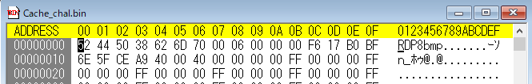

## 問題文

悪意ある人物が操作しているのか、ある PC が不審な動きをしています。

その PC から何かのキャッシュファイルを取り出すことに成功したらしいので、調べてみてください！

A PC is showing suspicious activity, possibly controlled by a malicious individual.

It seems a cache file from this PC has been retrieved. Please investigate it!

## 解法

バイナリエディタや cat コマンド等でバイナリヘッダを見ると，RDP8bmp...で始まっている．RDP とはつまりリモートデスクトッププロトコルで，キャッシュファイルも RDP 関連であると分かる．



渡されたキャッシュファイルは RDP ビットマップキャッシュで，RDP 中の画面が保存されている．

キャッシュファイルの場所は以下．

```
C:\Users\<ユーザ名>\AppData\Local\Microsoft\Terminal Server Client\Cache
```

以下のソフトを使えば画像の断片を取り出して，パズルができる．

パズルをしなくてもある程度の文字列は分ります．
FLAG が一部だけ読める状態だったため，勘違いしてしまった方もいたみたいです．

https://github.com/ANSSI-FR/bmc-tools

https://github.com/BSI-Bund/RdpCacheStitcher


ちなみに，NEC さんのブログに全部書いてあります．RDP キャッシュ 等で検索すると出てくる．

https://jpn.nec.com/cybersecurity/blog/231006/index.html

By looking at the binary header using a binary editor or the cat command, we see it starts with "RDP8bmp...". This means it is related to the Remote Desktop Protocol (RDP), and the cache file is an RDP bitmap cache. This cache contains saved images from an RDP session.


The original cache file is located here:

```
C:\Users\<username>\AppData\Local\Microsoft\Terminal Server Client\Cache
```

You can use these tools to extract image fragments and put them together:

https://github.com/ANSSI-FR/bmc-tools

https://github.com/BSI-Bund/RdpCacheStitcher

Even without putting all pieces together, some text might still be readable.
Due to FLAG being partially readable, it seems that some people got confused.


For more information, check the NEC blog (Japanese). Search for "RDP cache" or visit this link:

https://jpn.nec.com/cybersecurity/blog/231006/index.html
