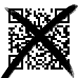
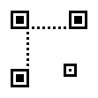
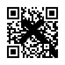

## 問題文

I, the codebreaker, have broken the QR code!

## 解法

png ファイルには QR が書かれているが一部塗りつぶされている．

QR のファインダパターン，アライメントパターン(要するに四角いところ)，必要であればタイミングパターン(白と黒が交互にくるところ)とクワイエットゾーンをペイントソフト等で補完してあげることで読み取れる．

QR コードで確定している場所は以下．

修復すると，QR コードの復元力に任せてスマホ等で読み取ることができる．

The PNG file contains a QR code that is partially obscured.

By using a painting software to restore the QR code's finder patterns, alignment patterns (the square areas), and, if necessary, the timing patterns (alternating black and white modules) and the quiet zone, the QR code can be made readable.

The following locations are defined in QR codes.

After repair, the QR Code can be read by a smart phone or other device, thanks to the resilience of the QR Code.

