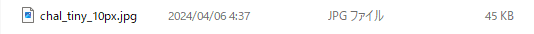
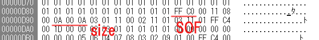
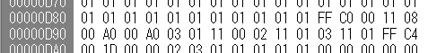
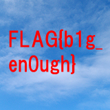

# tiny_10px

## 問題文

世界は狭い
What a small world!

## 解法

画像サイズとファイルサイズから、ファイルが大きすぎ、画像サイズが意図的に縮小されていることを疑う。

jpeg のサイズをバイナリで操作する場合、ffc0 ~ ffcf、(一般的には ffc0)で始まる SOF セグメントを検索すれば良い。

ffc0 で検索すると SOF セグメントがあり、オフセット 5 から 8 までが 00 0A 00 0A となっている。

これを適当に拡張すると空の画像とともに赤い文字が見え、拡張しすぎると範囲外を表す緑の部分が見えてくる。

緑の部分が見えない程度で良い感じに文字が見えるようなサイズを手動 bruteforce するとフラグが見える。

正解のサイズは 00 A0 00 A0 であるが、ざっくり 16 の位を適当に試していけばそのうち当たる。画像の幅(オフセット 7,8)が 00 50 のとき縦方向がそろって見えるので、幅をその倍の 00 A0 にすればよいことも推測できる。

Considering the image size and file size, you might suspect that the file is too large and the image size has been reduced.

When you manipulate the JPEG size in binary, you should look for the SOF segment, which starts with ffc0 to ffcf (generally ffc0).

If you search for FFC0, you will find the SOF segment, and from offset 5 to 8, you will see 00 0A 00 0A.

By extending this value appropriately, you will see red text on an empty image. If you extend it too much, you will see a green part indicating it is out of range.

By manually brute-forcing until the green part is no longer visible and the text appears clearly, you will find the flag.

The correct size is 00 A0 00 A0, but roughly trying different values for the 16th position will eventually get you the correct one. When the image width (offset 7 and 8) is 00 50, the vertical direction looks aligned, so you can guess that doubling the width to 00 A0 will work.

