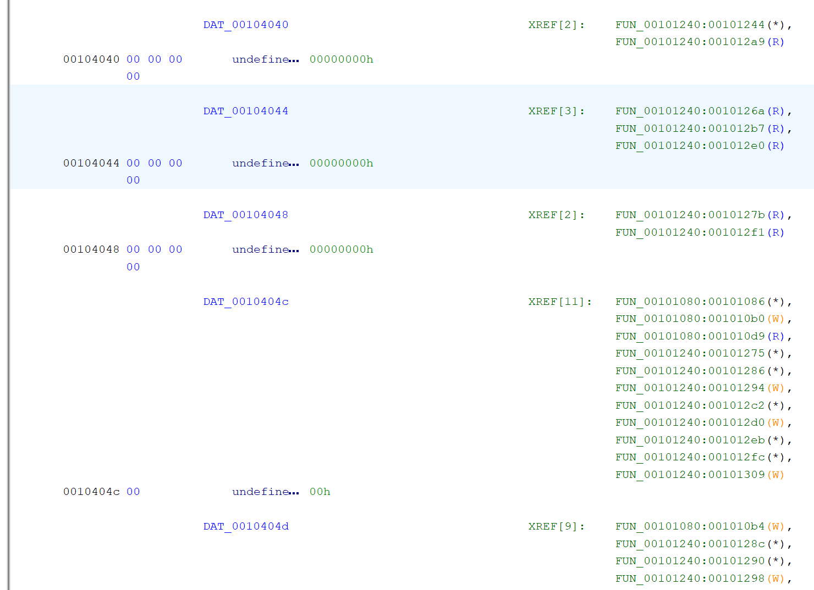
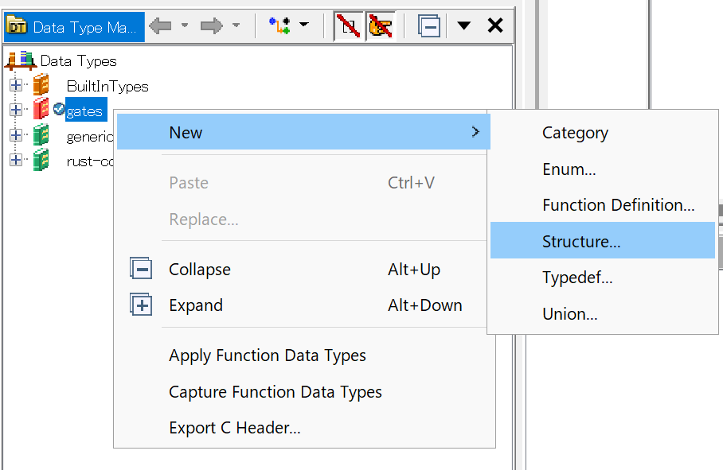
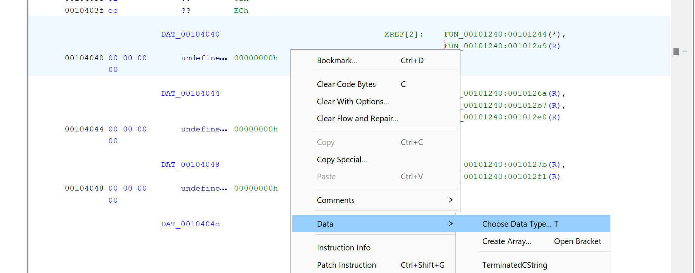
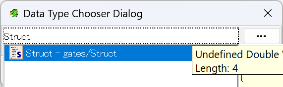
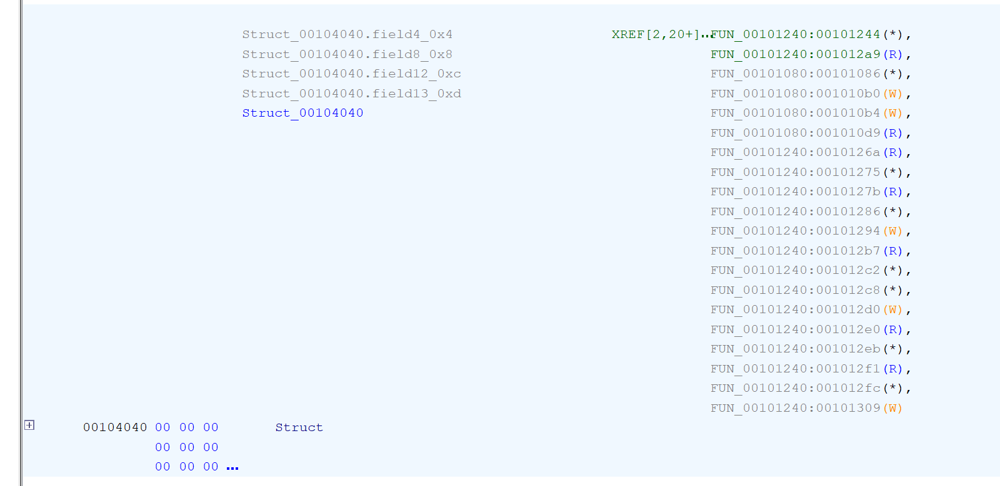
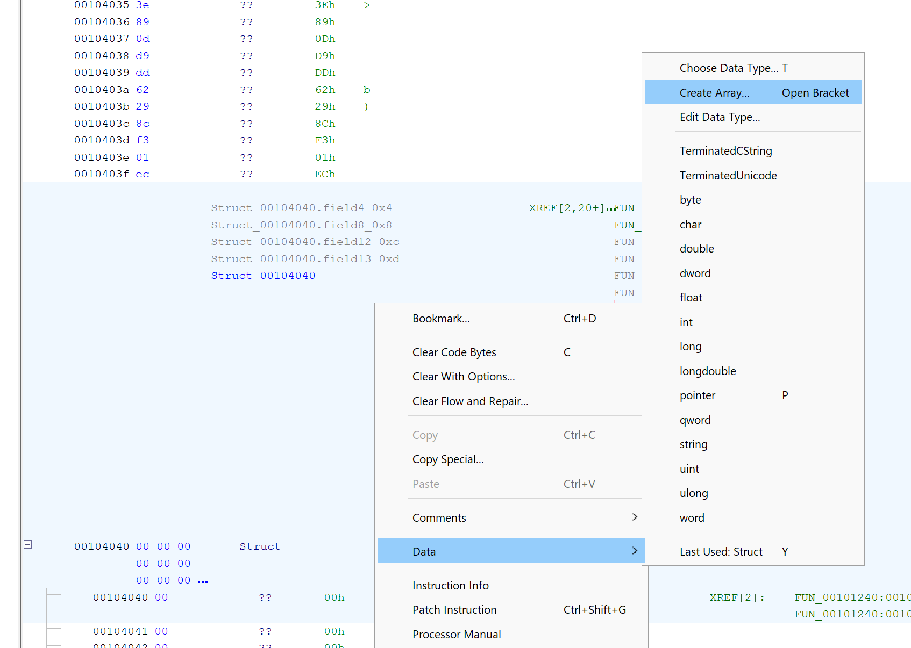
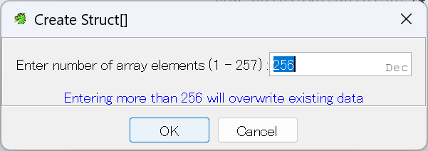
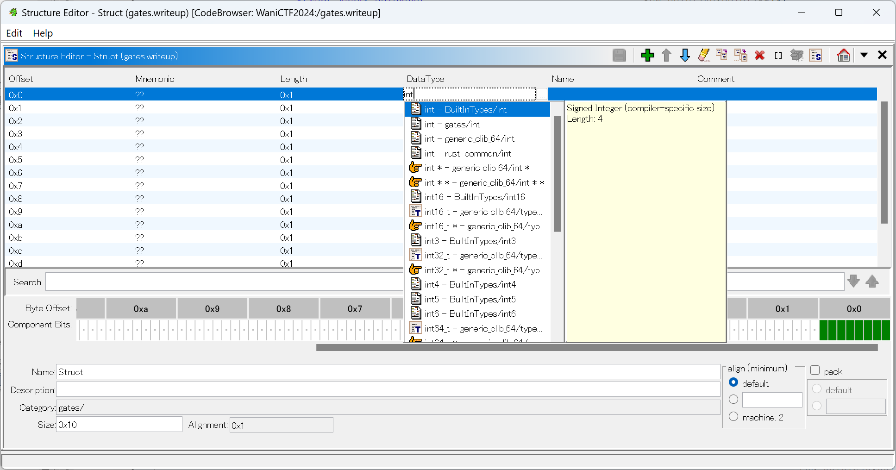
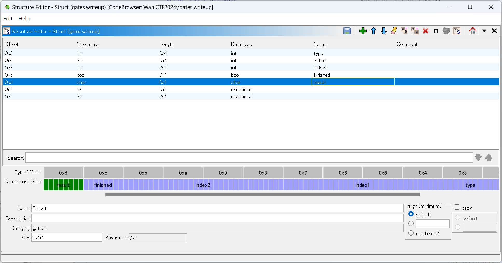

# gates

## 問題文 / Statement

ゲートにフラグを入れると、何かが出てきた。フラグはなんでしょう？

In to the gates go the flag, out comes something. What is the flag?

## 解法 / Writeup

The solution everyone probably used is `angr`, which I will not detail here (though you should definitely learn it, it can be used to solve problems where the writer failed to block it like this one!). The intended solution is using Ghidra to decipher the structure of a struct in the array, and figure out the algorithm.  
解いた人はたぶんみんな `angr` 使ってる気がするが、ここでは詳しく説明しない。（ただし今回みたいにポンコツ出題者がちゃんと `angr` で解けるかどうかを確認しないとき解けたりするので、使い方がわからない人は勉強したほうがいい。）今回の想定解は Ghidra で構造体の構造を読み解いて、そしてアルゴリズムを読み解くことである。

If we decompile the binary using Ghidra, we will see that all the logic are basically in 2 functions.  
Ghidra を使ってバイナリーを解析すると、ほとんどの計算は二つの関数に入っています。

```c
undefined8 FUN_00101080(void)

{
  int iVar1;
  char *pcVar2;
  undefined1 *puVar3;
  undefined1 *puVar4;
  char *pcVar5;
  
  puVar3 = &DAT_0010404c;
  do {
    puVar4 = puVar3 + 0x10;
    iVar1 = getc(stdin);
    *puVar3 = 1;
    puVar3[1] = (char)iVar1;
    puVar3 = puVar4;
  } while (puVar4 != &DAT_0010424c);
  pcVar5 = &DAT_0010504c;
  do {
    pcVar2 = &DAT_0010404c;
    while (*pcVar2 != '\0') {
      pcVar2 = pcVar2 + 0x10;
      if (pcVar2 == pcVar5) {
        pcVar5 = &DAT_00104e4d;
        pcVar2 = &DAT_00104020;
        do {
          if (*pcVar5 != *pcVar2) {
            puts("Wrong!");
            return 1;
          }
          pcVar5 = pcVar5 + 0x10;
          pcVar2 = pcVar2 + 1;
        } while (pcVar5 != &DAT_0010504d);
        puts("Correct!");
        return 0;
      }
    }
    FUN_00101240();
  } while( true );
}

void FUN_00101240(void)

{
  char cVar1;
  byte bVar2;
  char cVar3;
  undefined uVar4;
  byte bVar5;
  int iVar6;
  undefined8 *puVar7;
  long lVar8;
  
  puVar7 = (undefined8 *)&DAT_00104040;
  do {
    iVar6 = *(int *)puVar7;
    if (iVar6 == 3) {
      lVar8 = (long)*(int *)((long)puVar7 + 4) * 0x10;
      if (((&DAT_0010404c)[lVar8] != '\0') &&
         ((&DAT_0010404c)[(long)*(int *)(puVar7 + 1) * 0x10] != '\0')) {
        bVar5 = (&DAT_0010404d)[lVar8];
        bVar2 = (&DAT_0010404d)[(long)*(int *)(puVar7 + 1) * 0x10];
        *(undefined *)((long)puVar7 + 0xc) = 1;
        *(byte *)((long)puVar7 + 0xd) = bVar5 ^ bVar2;
      }
    }
    else if (iVar6 < 4) {
      if ((((iVar6 == 1) || (iVar6 == 2)) &&
          (lVar8 = (long)*(int *)((long)puVar7 + 4) * 0x10, (&DAT_0010404c)[lVar8] != '\0')) &&
         ((&DAT_0010404c)[(long)*(int *)(puVar7 + 1) * 0x10] != '\0')) {
        cVar3 = (&DAT_0010404d)[(long)*(int *)(puVar7 + 1) * 0x10];
        cVar1 = (&DAT_0010404d)[lVar8];
        *(undefined *)((long)puVar7 + 0xc) = 1;
        *(char *)((long)puVar7 + 0xd) = cVar3 + cVar1;
      }
    }
    else if ((iVar6 == 4) &&
            (lVar8 = (long)*(int *)((long)puVar7 + 4) * 0x10, (&DAT_0010404c)[lVar8] != '\0')) {
      uVar4 = (&DAT_0010404d)[lVar8];
      *(undefined *)((long)puVar7 + 0xc) = 1;
      *(undefined *)((long)puVar7 + 0xd) = uVar4;
    }
    puVar7 = puVar7 + 2;
  } while (puVar7 != &stdin);
  return;
}
```

We see `puVar4 = puVar3 + 0x10`, which means that it is probably holding structs with 16 (`0x10`) bytes. If we jump to `DAT_0010404c` we will see this:  
`puVar4 = puVar3 + 0x10` から、16 (`0x10`) バイトの構造体が格納されていることがわかる。`DAT_0010404c` を見ると下の図が見える：



looking at other code, the array probably start at `DAT_00104040`. Therefore, first we create a struct of size `0x10`. If you are using the default layout, you should find the "Data Type Manager" at the bottom left.  
近くのコードを見ると、たぶん配列は `DAT_00104040` から始まるだろう。なので、まず Ghidra で 16 バイトの構造体を定義する。デフォルトレイアウトであれば、左下に Data Type Manager があるはず。




Then we right click `DAT_00104040`, choose `Choose Data Type`, and enter `Struct`.  
`DAT_00104040` を右クリックして、`Choose Data Type` を選択し、`Struct` を入力する。





Finally, create the array. Ghidra helpfully tells us the array length is probably 256.  
最後に、配列を作成する。Ghidra が配列の長さがたぶん 256 であることを教えてくれる。




If we look at the pseudocode here, it looks far more readable now.  
疑似コードをもう一回読むと、前より読みやすくなったはず。

```c
void FUN_00101240(void)

{
  char cVar1;
  byte bVar2;
  char cVar3;
  undefined uVar4;
  byte bVar5;
  int iVar6;
  Struct *pSVar7;
  
  pSVar7 = Struct_ARRAY_00104040;
  do {
    iVar6 = *(int *)pSVar7;
    if (iVar6 == 3) {
      if ((Struct_ARRAY_00104040[*(int *)&pSVar7->field_0x4].field_0xc != '\0') &&
         (Struct_ARRAY_00104040[*(int *)&pSVar7->field_0x8].field_0xc != '\0')) {
        bVar5 = Struct_ARRAY_00104040[*(int *)&pSVar7->field_0x4].field_0xd;
        bVar2 = Struct_ARRAY_00104040[*(int *)&pSVar7->field_0x8].field_0xd;
        pSVar7->field_0xc = 1;
        pSVar7->field_0xd = bVar5 ^ bVar2;
      }
    }
    else if (iVar6 < 4) {
      if ((((iVar6 == 1) || (iVar6 == 2)) &&
          (Struct_ARRAY_00104040[*(int *)&pSVar7->field_0x4].field_0xc != '\0')) &&
         (Struct_ARRAY_00104040[*(int *)&pSVar7->field_0x8].field_0xc != '\0')) {
        cVar3 = Struct_ARRAY_00104040[*(int *)&pSVar7->field_0x8].field_0xd;
        cVar1 = Struct_ARRAY_00104040[*(int *)&pSVar7->field_0x4].field_0xd;
        pSVar7->field_0xc = 1;
        pSVar7->field_0xd = cVar3 + cVar1;
      }
    }
    else if ((iVar6 == 4) && (Struct_ARRAY_00104040[*(int *)&pSVar7->field_0x4].field_0xc != '\ 0'))
    {
      uVar4 = Struct_ARRAY_00104040[*(int *)&pSVar7->field_0x4].field_0xd;
      pSVar7->field_0xc = 1;
      pSVar7->field_0xd = uVar4;
    }
    pSVar7 = pSVar7 + 1;
  } while (pSVar7 != (Struct *)&stdin);
  return;
}
```

But we can make it even more readable, by telling Ghidra what each field is. So we try to determine the fields by reading the source code.

しかし、Ghidra に構造体のフィールド情報を追加すると、より読みやすくできるはず。ソースコードからフィールドの型を読み解いてみる。

- `0x0` is probably something like a type, so let's call it `type`.  
  `0x0` はたぶんタイプみたいなものだから `type` にする。
- `0x4`, `0x8` are used as indices, so let's call it `index1` and `index2`.  
  `0x4`、`0x8` は配列の添え字として使ってるから、`index1` と `index2` にする。
- `0xc` is used in `!= 0` and `= 1`, so it is probably a bool. Let's call it `finished`.  
  `0xc` は `!= 0` や `= 1` みたいに使われているのでたぶんブール値である。`finished` にする。
- `0xd` is used in calculation. Let's call it `result`.  
  `0xd` は計算で使われているので、`result` にする。




The pseudocode looks far more readable now.  
こうすると、疑似コードがより読みやすくなった。

```c

void FUN_00101240(void)

{
  byte bVar1;
  char cVar2;
  char cVar3;
  byte bVar4;
  int iVar5;
  Struct *pSVar6;
  
  pSVar6 = Struct_ARRAY_00104040;
  do {
    iVar5 = pSVar6->type;
    if (iVar5 == 3) {
      if ((Struct_ARRAY_00104040[pSVar6->index1].finished != false) &&
         (Struct_ARRAY_00104040[pSVar6->index2].finished != false)) {
        bVar4 = Struct_ARRAY_00104040[pSVar6->index1].result;
        bVar1 = Struct_ARRAY_00104040[pSVar6->index2].result;
        pSVar6->finished = true;
        pSVar6->result = bVar4 ^ bVar1;
      }
    }
    else if (iVar5 < 4) {
      if ((((iVar5 == 1) || (iVar5 == 2)) &&
          (Struct_ARRAY_00104040[pSVar6->index1].finished != false)) &&
         (Struct_ARRAY_00104040[pSVar6->index2].finished != false)) {
        cVar2 = Struct_ARRAY_00104040[pSVar6->index2].result;
        cVar3 = Struct_ARRAY_00104040[pSVar6->index1].result;
        pSVar6->finished = true;
        pSVar6->result = cVar2 + cVar3;
      }
    }
    else if ((iVar5 == 4) && (Struct_ARRAY_00104040[pSVar6->index1].finished != false)) {
      cVar3 = Struct_ARRAY_00104040[pSVar6->index1].result;
      pSVar6->finished = true;
      pSVar6->result = cVar3;
    }
    pSVar6 = pSVar6 + 1;
  } while (pSVar6 != (Struct *)&stdin);
  return;
}
```

It looks far more readable now. What remains is a simple reversing problem: we have a bunch of equations which are all solvable (1 of the operands and the result is always known, if the system is solved backwards), so just solve them. The explanation for the remaining part will be skipped. And thus we get the flag `FLAG{INTr0dUction_70_R3v3R$1NG1}`.  
最初よりだいぶ読みやすくなった。残りは簡単なリバーシング問題である。解きやすい方程式の組があって（後ろから解いて行くと、1つのオペランドと計算結果が既知なので）、それを解けばいい。なので、残りの説明は割愛する。解いていくと `FLAG{INTr0dUction_70_R3v3R$1NG1}` が出てくる。
