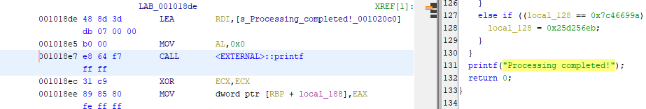
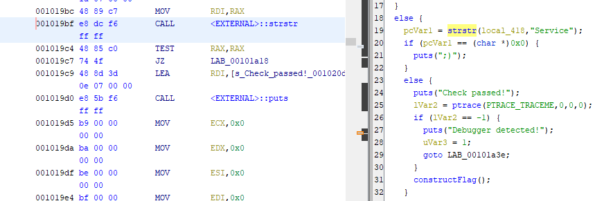

## 問題文

FLAG を処理してくれる関数は難読化しちゃいました。読みたくは……ないですね！

The function that processes the FLAG has been obfuscated. You don't want to read it... do you?

## 解法

Ghidra や objdump 等で動作とアドレスを確認する。

Ghidra で見ると、constructFlag 関数の中で Processing completed! と表示している。

constructFlag は難読化されているので、できれば読みたくない。
変数として FLAG が返されているわけではないが、この表示が出ているときに FLAG がメモリ上にありそうなのでここを目指す。



constructFlag 関数を呼び出すためには、何かの判定を突破しないといけない。



ここの判定はデバッガで突破できるので、それを目指す。

Ghidra で見ると 0x0010197f の処理が pwndbg で見ると 0x55555555597f になっているので、以降はこの差分を考慮して pwndbg で breakpoint を貼る。

文字列の判定をした直後に breakpoint を貼り、eflags の 6 番目 (ZF) を 0 にすることで、if の分岐を else の方に行くことができる。

```
pwndbg> b* 0x5555555559c7
pwndbg> start
pwndbg> c
```

```
pwndbg> i r
(中略)
eflags         0x246               [ PF ZF IF ]
```

```
pwndbg> set $eflags &= ~(1 << 6)
pwndbg> i r
(中略)
eflags         0x206               [ PF IF ]
```

Debugger Detected! に分岐する部分でも同様。

```
pwndbg> b* 0x5555555559f7
pwndbg> c
pwndbg> set $eflags &= ~(1 << 6)
```

分岐を回避できたので、 Processing completed! と表示されるところまで飛ぶ。

変数に FLAG が格納されているかは分からない (難読化された constructFlag は読みたくない) ので、メモリ上の FLAG を探す。

```
pwndbg> b* 0x5555555558e7
pwndbg> c
pwndbg> search "FLAG{"
[stack]         0x7fffffffd290 'FLAG{How_did_you_get_here_4VKzTLibQmPaBZY4}'
```

Check the operation and address with Ghidra, objdump, etc.

Ghidra shows "Processing completed!" in the constructFlag function.

constructFlag is obfuscated, so you don't want to read it.
Although FLAG is not returned as a variable, it seems likely that FLAG is in memory when this display occurs, so this is the target.


To call the constructFlag function, a certain if-else must be bypassed.


The process at 0x0010197f in Ghidra appears as 0x55555555597f in pwndbg, so from here on, we consider this offset when setting breakpoints in pwndbg.

By making a breakpoint immediately after the string comparing and setting the 6th (ZF) of eflags to 0, the if branch can go to the else branch.

```
pwndbg> b* 0x5555555559c7
pwndbg> start
pwndbg> c
```

```
pwndbg> i r
(omitted)
eflags         0x246               [ PF ZF IF ]
```

```
pwndbg> set $eflags &= ~(1 << 6)
pwndbg> i r
(omitted)
eflags         0x206               [ PF IF ]
```

Do the same for the branch leading to "Debugger Detected!":

```
pwndbg> b* 0x5555555559f7
pwndbg> c
pwndbg> set $eflags &= ~(1 << 6)
```

Having bypassed the branches, we continue to the point where "Processing completed!" is displayed.

It's unclear if some variable contains a FLAG (as constructFlag is obfuscated and we don't want to read it), so we search for FLAG in memory.

```
pwndbg> b* 0x5555555558e7
pwndbg> c
pwndbg> search "FLAG{"
[stack]         0x7fffffffd290 'FLAG{How_did_you_get_here_4VKzTLibQmPaBZY4}'
```
