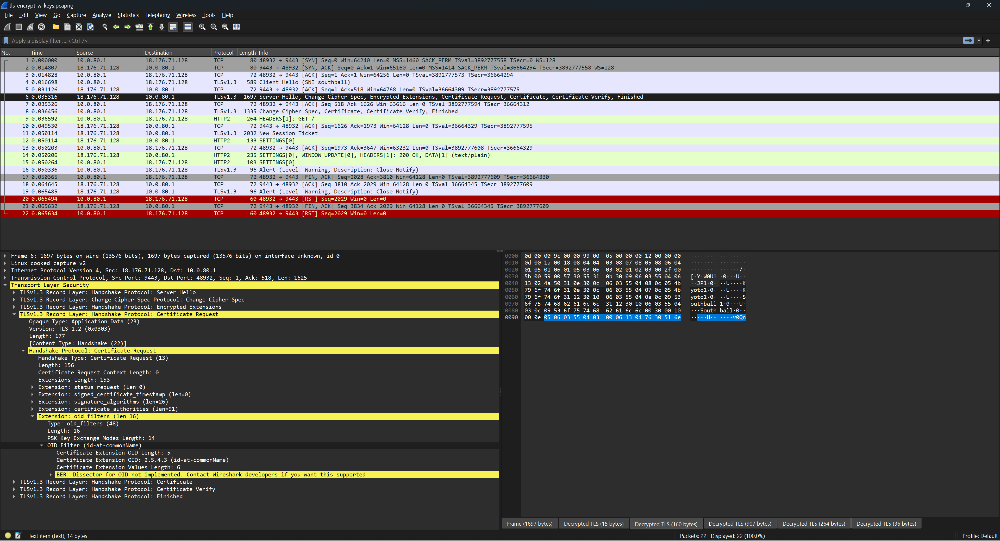

# tls_spec

## 問題文 / Statement

I read the specification for TLS and made a problem.

TLS の仕様を読んで問題を作った。

https://chal-lz56g6.wanictf.org:9443/

Hint: `curl --cacert server.crt --resolve Southball:<PORT>:<IP> https://chal-lz56g6.wanictf.org:9443`

---

NOTE: In case the server is down, try the following backup server. 上記のサーバーが正しく動作していない場合は、次のバックアップサーバーを使用してください。

`chal-ywu5dn.wanictf.org`

## 解法 / Writeup

日本語の解法を書くのだるいので English Writeup を読んでください... 🙇

This problem is mainly about the `oid_filters` extension, which sadly no one implements 😢

When we first access the server, we will see the `NET::ERR_CERT_COMMON_NAME_INVALID` error. This is because the server uses a certificate with common name `Southball` which not the same as the host. So we continue anyway...

and we are met with the `ERR_BAD_SSL_CLIENT_AUTH_CERT` error. This lets us know that we need a client certificate. So we issue one.

```sh
$ openssl genpkey -algorithm RSA -out client.key -pkeyopt rsa_keygen_bits:2048

$ openssl req -new -key client.key -out client.csr
You are about to be asked to enter information that will be incorporated
into your certificate request.
What you are about to enter is what is called a Distinguished Name or a DN.
There are quite a few fields but you can leave some blank
For some fields there will be a default value,
If you enter '.', the field will be left blank.
-----
Country Name (2 letter code) [AU]:
State or Province Name (full name) [Some-State]:
Locality Name (eg, city) []:
Organization Name (eg, company) [Internet Widgits Pty Ltd]:
Organizational Unit Name (eg, section) []:
Common Name (e.g. server FQDN or YOUR name) []:
Email Address []:

Please enter the following 'extra' attributes
to be sent with your certificate request
A challenge password []:
An optional company name []:

$ openssl x509 -req -in client.csr -CA intermediateCACert.pem -CAkey intermediateCAKey.pem -CAcreateserial -out client.crt -days 365 -sha256

$ curl --cacert server.crt --resolve Southball:9443:$(dig +short chal-lz56g6.wanictf.org) https://Southball:9443 --cert client.crt --key client.key
You have client certificate, but not the correct one
```

The server tells us that it is not the correct client certificate, but what is the correct client certificate?

The information is hidden in the server handshake.

```sh
$ sudo nohup tcpdump -i any -n tcp port 9443 -w tls_packets.pcap & TCPDUMP=$!

$ SSLKEYLOGFILE=./tls.keys curl --cacert server.crt --resolve Southball:9443:$(dig +short) https://Southball:9443 --cert client.crt --key client.key

$ kill $TCPDUMP

$ editcap --inject-secrets tls,./tls.keys ./tls_packets.pcap ./tls_encrypt_w_keys.pcapng
```

When we open `tls_encrypt_w_keys.pcapng` we can see the `oid_filters`.



The value part is `13 04 76 30 51 6E` which is ASN.1 encoding of `PrintableString v0Qn`.

So this is the correct way to solve it. (Notice the `Common Name` when generating the CSR.)

```sh
$ openssl genpkey -algorithm RSA -out client2.key -pkeyopt rsa_keygen_bits:2048

$ openssl req -new -key client2.key -out client2.csr
You are about to be asked to enter information that will be incorporated
into your certificate request.
What you are about to enter is what is called a Distinguished Name or a DN.
There are quite a few fields but you can leave some blank
For some fields there will be a default value,
If you enter '.', the field will be left blank.
-----
Country Name (2 letter code) [AU]:
State or Province Name (full name) [Some-State]:
Locality Name (eg, city) []:
Organization Name (eg, company) [Internet Widgits Pty Ltd]:
Organizational Unit Name (eg, section) []:
Common Name (e.g. server FQDN or YOUR name) []:v0Qn
Email Address []:

Please enter the following 'extra' attributes
to be sent with your certificate request
A challenge password []:
An optional company name []:

$ openssl x509 -req -in client2.csr -CA intermediateCACert.pem -CAkey intermediateCAKey.pem -CAcreateserial -out client2.crt -days 365 -sha256

$ curl --cacert server.crt --resolve Southball:9443:$(dig +short chal-lz56g6.wanictf.org) https://Southball:9443 --cert client2.crt --key client2.key
FLAG{WHY_doE5_No_ON3_iMPl3Ment_Oid_fi1tErS}
```